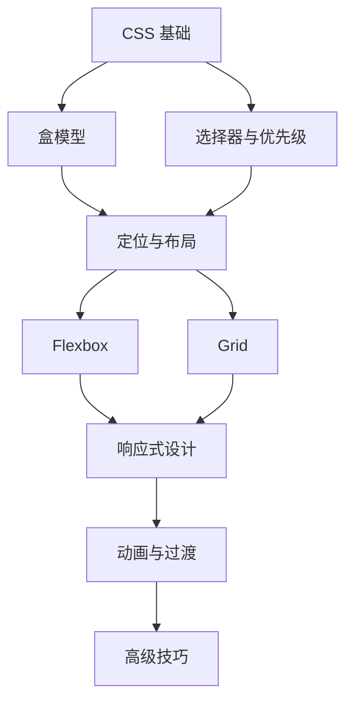

---
tags:
  - tech/lang/css
  - type/moc
  - status/evergreen
description: CSS层叠样式表知识索引
created: 2025-01-15T00:00:00
updated: 2025-01-15T00:00:00
---

> [!info] **上级索引**
> [[前端基础 MOC]] | [[ECMAScript MOC]]

---

# CSS MOC

> CSS（层叠样式表）是用于控制网页外观和布局的样式语言。本索引整理CSS相关的核心概念、布局技术、实践技巧和常见问题解决方案。

---

## 📦 核心概念

### 基础理论
- [[CSS]] - CSS 概述与基础
- [[盒模型]] - 标准盒模型与IE盒模型
- [[样式优先级和特异性]] - 选择器权重与层叠规则

### 定位与显示
- [[position]] - 定位属性详解（static/relative/absolute/fixed/sticky）
- [[display]] - 显示模式（block/inline/inline-block/none）
- [[float]] - 浮动布局与清除浮动

---

## 🎨 布局技术

### 现代布局
- [[flex]] - Flexbox 弹性盒子布局
- [[grid]] - CSS Grid 网格布局
- [[网页的响应式布局（网页平板手机）]] - 响应式设计实践

### 经典布局问题
- [[内容超出容器问题的解决方案文档]] - 溢出处理方案
- [[按钮和文字在页面放大比例变化时出现未完全垂直居中情况]] - 垂直居中问题

---

## ✨ 视觉效果

### 阴影与动画
- [[box-shadow详解]] - 阴影效果详解
- [[制作一个css动画]] - CSS 动画制作

### 图形与图标
- [[svg的使用]] - SVG 矢量图形使用指南

### 主题与样式
- [[主题切换实现]] - 明暗主题切换
- [[组件库修改内置样式]] - 覆盖组件库样式
- [[去除最外侧滚动条]] - 滚动条样式处理

---

## 🛠️ 工具与图标

### 预处理与构建
- [[postcss]] - PostCSS 插件与配置
- [[Unocss]] - UnoCSS 原子化 CSS 引擎

### 图标库
- [[Lucide]] - Lucide Icons 图标库

---

## 📚 相关索引

- [[前端基础 MOC]] - 前端基础知识总览
- [[ECMAScript MOC]] - JavaScript 语言核心
- [[Vue3 MOC]] - Vue3 框架专题

---

## 📊 学习路径



---

> [!tip] 使用 Dataview 查询所有 CSS 相关笔记
> ```dataview
> LIST
> FROM #tech/lang/css
> SORT file.name ASC
> ```

## 📚 全部 CSS 笔记（按子类分组）

### 基础理论
- [[CSS]]
- [[盒模型]]
- [[样式优先级和特异性]]

### 布局与定位
- [[flex]]
- [[grid]]
- [[position]]
- [[display]]
- [[float]]

### 样式效果
- [[box-shadow详解]]
- [[制作一个css动画]]
- [[主题切换实现]]

### 工具与预处理
- [[postcss]]
- [[Unocss]]

### 兼容性与问题修复
- [[内容超出容器问题的解决方案文档]]
- [[去除最外侧滚动条]]

---
