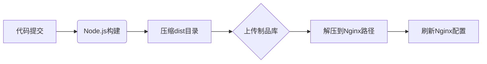

---
tags:
  - tech/ops/cloud
  - type/concept
  - status/growing
description: CodeArts
created: 2025-01-01T00:00:00
updated: 2025-12-07T21:16:37
---

> [!info] **上级索引**
> [[VPS MOC]] | [[DevOps MOC]]

---


## CodeArts

**华为云一站式DevOps平台，涵盖项目管理、代码托管、流水线、测试、部署等全生命周期服务**

---

### **基础概念**

1. **核心组件**
- **代码托管**：Git仓库管理，支持导入GitHub/GitLab代码。
- **流水线**：CI/CD自动化流程（构建、测试、部署）。
- **项目管理**：敏捷看板、需求跟踪、任务协同（Scrum/IPD模型）。
- **制品仓库**：存储构建产物（如JAR包、Docker镜像）。

2. **关键术语**
- **构建任务**：将源代码编译为可部署产物。
- **部署模板**：预置脚本（如SpringBoot/Vue部署）。
- **主机集群**：管理目标服务器（SSH密钥绑定）。

---

### **使用指南**

#### **1. 项目创建与管理**

- **权限配置**：
- 租户管理员进入 **控制台 > 租户设置 > 通用设置**，开启“所有成员可创建项目”。
- **新建项目**：

```plaintext
工作台 → 新建项目 → 选择模板（Scrum/IPD）→ 填写名称/描述
```

- **项目维护**：
- **移交创建人**：项目设置 → 基本信息 → 修改创建人。
- **归档项目**：项目设置 → 归档（保留只读视图）。

#### **2. 代码托管**

- **导入外部仓库**：

```plaintext
代码托管 → 新建仓库 → 导入 → 输入GitHub URL及Token
```

- **分支策略**：
- **保护分支**：禁止直接推送 → 需合并请求（MR）。
- **自动触发流水线**：`master`分支提交时自动构建。

#### **3. 流水线配置**

**后端项目（SpringBoot）**


- **构建步骤**：
- 选择Maven模板 → 配置JDK版本 → 定义输出路径（`target/*.jar`）。
- **部署步骤**：
- 添加主机集群 → 上传JAR包 → Shell命令：

```bash
nohup java -jar /opt/app.jar &
```

**前端项目（Vue）**



- **关键配置**：
- 构建命令：`npm install && npm run build`
- 部署模板：选择“通用部署” → 自定义Nginx根目录（`/usr/share/nginx/html`）。

---

### **实战经验**

#### **场景1：自动部署到多台服务器**

1. **配置主机集群**：
- 添加多台ECS → 绑定同一SSH密钥。
2. **并行部署策略**：
- 流水线添加 **并行任务** → 每台服务器执行相同部署脚本。

#### **场景2：流水线失败自动通知**

1. **钉钉机器人集成**：
- 流水线 → 通知设置 → Webhook → 输入钉钉机器人URL。
2. **条件触发**：
- 仅当“构建失败”或“部署超时”时发送告警。

#### **避坑指南**

- **权限问题**：
- 部署失败？检查ECS安全组是否开放SSH端口（默认22）。
- **构建缓存**：
- `node_modules`未更新？构建步骤添加 `rm -rf node_modules`。
- **资源释放**：
- 长期不用的流水线 → 禁用 → 避免占用构建配额。

---

### **经验总结**

1. **高效协作**：
- 使用 **需求看板** 关联代码提交 → 任务进度实时同步。
2. **安全实践**：
- 敏感信息（如数据库密码）存入 **微服务引擎CSE配置中心**，非明文写入脚本。
3. **成本优化**：
- 利用 **免费额度**：每月500分钟构建时长 + 2GB制品存储。
4. **扩展性**：
- 复杂场景调用 **API Explorer**：自动化创建项目/触发流水线。

---

### **信息参考**

- **官方资源**：
- [CodeDocs文档中心](https://support.huaweicloud.com/devcloud/)
- 模板仓库：[SpringBoot部署示例](https://github.com/huaweicloud/CodeArts-Lab)
- **学习路径**：
- 新手 → 控制台“快速入门”引导（5分钟完成第一个流水线）。
- 进阶 → 认证课程《华为云DevOps实践》（华为云学堂免费开放）。
- **技术支持**：
- 工单入口：控制台右上角 **工单 > 新建工单**。
- 社区论坛：[DevCloud开发者论坛](https://bbs.huaweicloud.com/forum/forum-728-1.html)

> **提示**：首次使用可领取 **免费体验包**（含CodeArts基础版+ECS资源），有效期30天。
