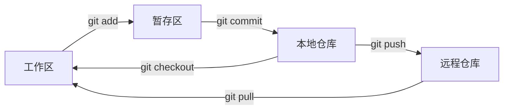

---
tags:
  - tech/dev/git
  - type/concept
  - status/evergreen
description: Git 分布式版本控制系统核心概念
created: 2025-09-29T13:53:12
updated: 2025-12-07T17:00:00
---

# Git 

**上级索引**：[[Git MOC]]

## 基础概念

### 核心工作原理

Git 是一个分布式版本控制系统，具有以下特点：

- **分布式架构**：客户端会完整镜像代码仓库，任何协同工作服务器故障后都可以用本地仓库恢复
- **数据完整性**：通过 SHA-1 散列计算校验和来引用数据，40 位十六进制字符串唯一标识每次提交
- **版本库平等**：项目开始时只有一个原始仓库，其他机器克隆后版本库内容相同，没有主次之分

### Git 工作区域

Git 项目包含四个工作区域：

| 工作区域     | 描述                       | 位置                 |
| ------------ | -------------------------- | -------------------- |
| **工作区**   | 本地编写代码的区域         | 项目根目录           |
| **暂存区**   | 临时存放修改文件的区域     | `.git/index` 文件    |
| **本地仓库** | 存储项目元数据和对象数据库 | `.git` 目录          |
| **远程仓库** | 托管在网络上的版本仓库     | GitHub/GitLab 等平台 |

### 基本工作流程



基本流程：

1. 克隆资源作为工作目录
2. 添加/修改文件
3. 将修改添加到暂存区
4. 提交前查看修改
5. 提交修改到本地仓库
6. 推送到远程仓库
7. 必要时撤回修改

## Git 分支管理

### 常见分支策略

#### 1. Git Flow

适用于版本发布项目，包含两个长期分支和三个临时分支：

**长期分支：**

- `main`：发布稳定版本
- `develop`：最新开发代码

**临时分支：**

- `feature/*`：功能开发分支
- `release/*`：预发布分支
- `hotfix/*`：紧急 Bug 修复分支

```mermaid
gitgraph
    commit id: "Initial"
    branch develop
    checkout develop
    commit id: "Dev 1"
    branch feature/login
    checkout feature/login
    commit id: "Login feature"
    checkout develop
    merge feature/login
    branch release/1.0
    checkout release/1.0
    commit id: "Bug fixes"
    checkout main
    merge release/1.0 tag: "v1.0"
    checkout develop
    merge release/1.0
```

#### 2. GitHub Flow

适用于持续部署项目：

1. 从 `main` 分支拉取新分支开发
2. 完成后发起 Pull Request
3. 经过代码审查后合并到 `main`
4. 部署到生产环境

#### 3. GitLab Flow

遵循"上游优先"原则：

- 只存在一个主分支 `master`
- `master` 是其他分支的 upstream
- 代码变化必须由上游向下游发展

开发`统一错误处理(新功能）`的流程

```powershell
git branch -a | Select-String "dev"

git checkout -b dev

git checkout -b feature/refactor-error-handling

git checkout dev

> git merge feature/refactor-error-handling --no-ff -m "chore: merge feature/refactor-error-handling into dev  
  
Completed refactoring work:  
- Day 1.1-1.4: Unified error handling (DomainError base + Task errors + Controller updates)  
- Day 2.1: Test environment configuration  
  
Total: 10 commits, 7 files changed  
Quality improvement: Error handling 0% -> 90%"

> git push origin dev
```
### Git Tag

Git Tag 是 Git 版本控制系统中用于标记特定提交(commit)的重要功能  

它本质上是一个指向特定提交的静态指针  

与分支(branch)不同，标签(tag)不会随着新的提交而移动，它始终指向创建时指定的那个提交  

标签类型：  

1. 轻量标签  

    仅是一个指向特定提交的引用  

    `git tag v1.0.0`  

2. 附注标签  

    存储在 Git 数据库中的完整对象，包含标签名、标签信息、标签签名等元数据。  

    `git tag -a v1.0.0 -m 'Release version 1.0.0' HEAD`

### GitHub Flow 工作流

GitHub Flow 是一种轻量级的 Git 工作流程，特别适合持续交付和部署的场景。

它由 GitHub 推广并广泛应用于开源项目和敏捷开发团队中。

核心原则：  

1. 单一主分支  
2. 功能分支开发  
3. Pull Request  
4. 持续部署


