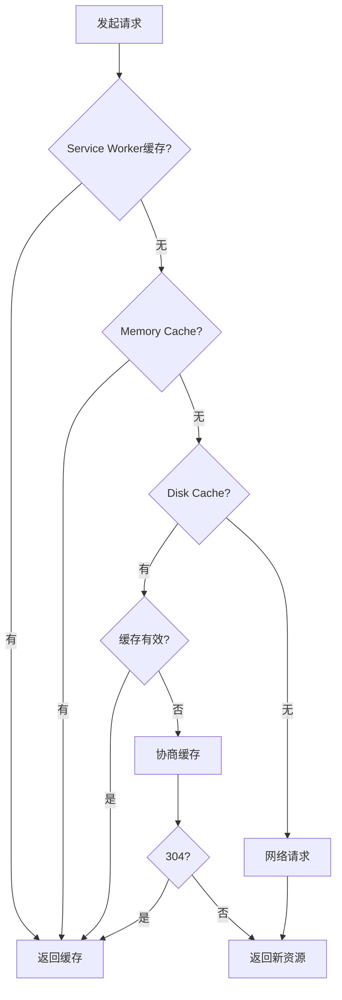

---
tags:
  - tech/ops/network
  - type/concept
  - status/growing
description: HTTP缓存
created: 2025-01-01T00:00:00
updated: 2025-12-07T21:16:37
---

> [!info] **上级索引**
> [[前端基础 MOC]] | [[计算机网络 MOC]]

---


# HTTP 缓存

## 核心原理

### 基本概念

HTTP 缓存是将静态资源（如 HTML、CSS、JS、图片等）保存在客户端或中间代理服务器（如 CDN）中。当请求相同资源时，若缓存有效，直接返回本地副本，避免重复请求服务器。

- **缓存标识**  
  通过 `ETag`（资源唯一标识）或 `Last-Modified`（最后修改时间）区分资源版本
- **缓存位置**  
  包括浏览器缓存、代理服务器缓存（如 CDN）和数据库缓存等

### 缓存控制头字段

| 字段                | 类型      | 说明                         | 示例                            |
| ------------------- | --------- | ---------------------------- | ------------------------------- |
| `Cache-Control`     | 响应/请求 | 控制缓存行为                 | `max-age=3600`                  |
| `Expires`           | 响应      | 缓存过期时间（HTTP/1.0）     | `Wed, 21 Oct 2025 07:28:00 GMT` |
| `ETag`              | 响应      | 资源唯一标识                 | `"33a64df5"`                    |
| `Last-Modified`     | 响应      | 资源最后修改时间             | `Wed, 21 Oct 2025 07:28:00 GMT` |
| `If-None-Match`     | 请求      | 条件请求，配合 ETag          | `"33a64df5"`                    |
| `If-Modified-Since` | 请求      | 条件请求，配合 Last-Modified | `Wed, 21 Oct 2025 07:28:00 GMT` |

### Cache-Control 常用指令

| 指令                | 说明                       |
| ------------------- | -------------------------- |
| `max-age=<seconds>` | 缓存最大存活时间           |
| `no-cache`          | 需要向服务器验证缓存有效性 |
| `no-store`          | 不缓存任何内容             |
| `public`            | 可被任何缓存存储           |
| `private`           | 只能被浏览器缓存           |
| `must-revalidate`   | 缓存过期后必须重新验证     |

## 缓存策略类型

### 强缓存

客户端不发送请求到服务器，直接使用本地缓存资源。

**控制字段：**

- `Cache-Control: max-age=<seconds>`
- `Expires`（HTTP/1.0，优先级低）

**流程：**

1. 浏览器检查缓存是否存在且未过期
2. 如果有效，直接返回缓存内容（状态码：200 from cache）
3. 如果无效或不存在，发送请求到服务器

```http
# 响应头示例
Cache-Control: max-age=86400
Expires: Thu, 21 Jun 2025 09:00:00 GMT
```

### 协商缓存

客户端发送请求，服务器判断缓存是否有效。

**控制字段：**

- `ETag` / `If-None-Match`
- `Last-Modified` / `If-Modified-Since`

**流程：**

1. 浏览器发送带条件的请求
2. 服务器比较资源是否改变
3. 未改变：返回 304 Not Modified
4. 已改变：返回 200 及新内容

```http
# 首次请求响应
ETag: "33a64df5"
Last-Modified: Wed, 20 Jun 2025 15:30:00 GMT

# 再次请求
If-None-Match: "33a64df5"
If-Modified-Since: Wed, 20 Jun 2025 15:30:00 GMT
```

### 缓存策略对比

| 对比项         | 强缓存           | 协商缓存         |
| -------------- | ---------------- | ---------------- |
| **网络请求**   | 不发送           | 发送条件请求     |
| **服务器负载** | 无               | 轻微             |
| **响应速度**   | 最快             | 较快             |
| **状态码**     | 200 (from cache) | 304 Not Modified |
| **适用场景**   | 不频繁更新的资源 | 需要验证的资源   |

## 缓存存储与生命周期

### 缓存存储位置

1. **Service Worker**

   - 可编程缓存
   - 离线功能支持
   - 优先级最高

2. **Memory Cache**

   - 内存缓存
   - 速度最快
   - 进程退出后清空

3. **Disk Cache**

   - 磁盘缓存
   - 持久存储
   - 容量较大

4. **Push Cache**
   - HTTP/2 推送缓存
   - 会话级别
   - 优先级最低

### 缓存决策流程



## 缓存应用实践

### 最佳实践策略

1. **HTML 文件**

   ```http
   Cache-Control: no-cache
   ```

2. **CSS/JS 文件**

   ```http
   Cache-Control: public, max-age=31536000
   # 配合文件指纹（hash）
   ```

3. **图片资源**

   ```http
   Cache-Control: public, max-age=86400
   ```

4. **API 接口**
   ```http
   Cache-Control: no-cache, must-revalidate
   ```

### 缓存更新策略

1. **版本号方式**

   ```html
   <link rel="stylesheet" href="style.css?v=1.0.1" />
   ```

2. **文件指纹方式**

   ```html
   <script src="app.a1b2c3d4.js"></script>
   ```

3. **强制刷新**
   ```http
   Cache-Control: no-cache, no-store, must-revalidate
   ```

### 性能优化建议

- 合理设置缓存时间
- 静态资源使用 CDN
- 启用 Gzip 压缩
- 使用 HTTP/2 推送
- 定期清理过期缓存
- 监控缓存命中率

### 常见问题处理

1. **缓存穿透**：大量无效请求绕过缓存
2. **缓存雪崩**：大量缓存同时失效
3. **缓存击穿**：热点数据缓存失效

通过合理配置 HTTP 缓存策略，可以显著提升网站性能，减少服务器负载，改善用户体验。

### 不同刷新方式的影响：

- 正常输入URL回车：优先使用强缓存
- F5刷新：跳过强缓存，检查协商缓存
- Ctrl+F5强制刷新：跳过所有缓存，直接从服务器获取 
