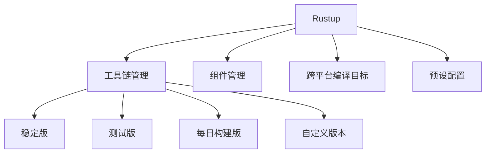
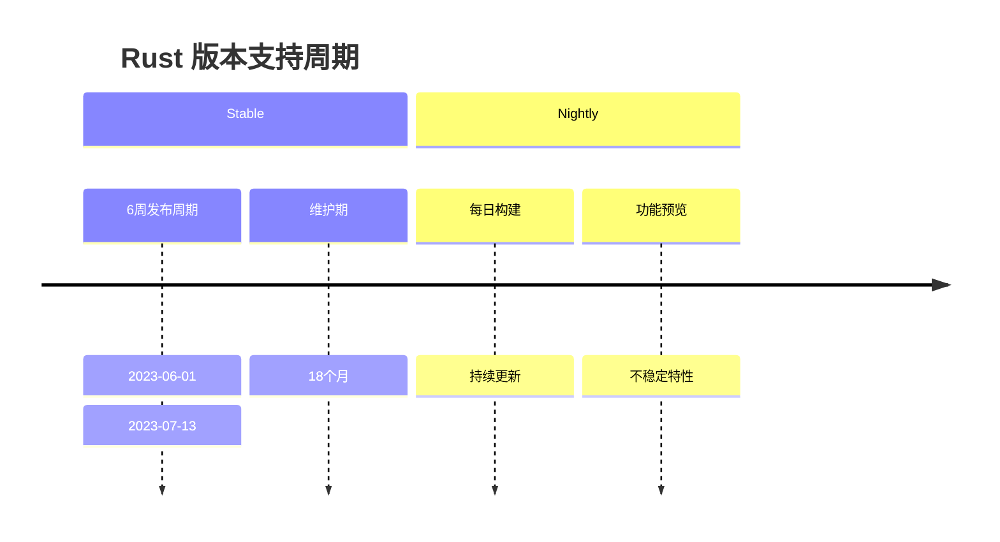

---
tags:
  - tech/lang/rust
  - type/howto
  - status/growing
description: Rustup
created: 2025-01-01T00:00:00
updated: 2025-12-07T21:16:37
---

> [!info] **上级索引**
> [[Rust]] | [[Resource]]

---


# **Rustup 工具链管理深度指南**

## **1. 基础概念**
### **Rustup 是什么？**
Rustup 是 Rust 官方推荐的**工具链管理工具**，相当于：
- Node.js 的 `nvm`
- Python 的 `pyenv`
- Ruby 的 `rvm`

### **核心功能架构**


### **关键术语**
| 术语| 说明|
|------------|-----------------------------|
| Toolchain| 完整的 Rust 环境（rustc + cargo + 工具） |
| Component| 工具链的可选组件（如 rustfmt, clippy）|
| Target| 交叉编译目标（如 x86_64-pc-windows-gnu） |
| Profile| 预定义的组件集合（minimal/default/complete） |

## **2. 使用指南**
### **安装与初始化**
```bash
# Linux/macOS
curl --proto '=https' --tlsv1.2 -sSf https://sh.rustup.rs | sh

# Windows (PowerShell)
winget install Rustlang.Rustup
```

### **常用命令速查**
| 命令 | 作用 | 示例 |
|------|------|------|
| `rustup update` | 更新所有工具链 | `rustup update nightly` |
| `rustup default` | 设置默认工具链 | `rustup default stable` |
| `rustup target add` | 添加编译目标 | `rustup target add wasm32-unknown-unknown` |
| `rustup component add` | 添加组件 | `rustup component add rustfmt` |
| `rustup show` | 显示当前配置 | `rustup show` |

### **多版本管理实战**
```bash
# 安装特定版本
rustup install 1.70.0

# 临时使用版本
rustup run 1.69.0 cargo build

# 创建版本别名
rustup toolchain link my-project /path/to/custom-toolchain
```

## **3. 实战经验**
### **性能优化技巧**
1. **镜像加速配置**：
```bash
export RUSTUP_DIST_SERVER=https://mirrors.ustc.edu.cn/rust-static
export RUSTUP_UPDATE_ROOT=https://mirrors.ustc.edu.cn/rust-static/rustup
```

2. **最小化安装**：
```bash
rustup install stable --profile minimal
```

3. **组件按需安装**：
```bash
rustup component add clippy --toolchain nightly
```

### **典型问题解决方案**
**问题：`error: toolchain 'nightly-x86_64-unknown-linux-gnu' is not installed`**
解决：
```bash
rustup install nightly
rustup component add rust-src --toolchain nightly
```

**问题：VSCode RLS 无法识别工具链**
解决：
```json
// settings.json
{
"rust-client.rustupPath": "/path/to/rustup",
"rust-client.channel": "stable"
}
```

## **4. 经验总结**
### **最佳实践**
- **生产环境**：始终使用 `stable` 版本
- **开发尝鲜**：隔离 `nightly` 到单独目录
- **CI/CD**：明确指定工具链版本
```yaml
# GitHub Actions 示例
- uses: actions-rs/toolchain@v1
with:
toolchain: 1.70.0
components: rustfmt, clippy
```

### **性能对比**
| 操作| 耗时（首次） | 耗时（缓存后） |
|-------------------|------------|-------------|
| 完整安装 (`complete`) | ~5min| ~1min|
| 最小安装 (`minimal`)| ~30s| ~10s|

## **5. 信息参考**
### **官方资源**
- [rustup 文档](https://rust-lang.github.io/rustup/)
- [组件列表](https://rust-lang.github.io/rustup-components-history/)
- [镜像列表](https://forge.rust-lang.org/infra/other-installation-methods.html)

### **扩展工具**
| 工具 | 用途 |
|------|------|
| `rustup-toolchain-install-master` | 安装任意Git提交版本 |
| `cross` | 简化交叉编译 |
| `cargo-bisect-rustc` | 版本问题诊断 |

### **版本支持周期**


通过合理使用 rustup，开发者可以：
1. 实现多版本无缝切换
2. 精确控制开发环境
3. 优化构建速度和存储空间
