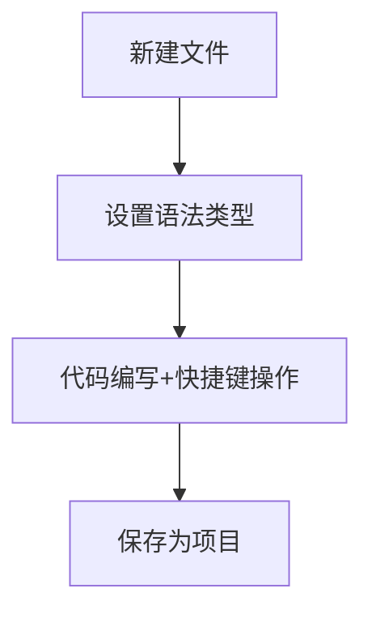

---
tags:
  - tech/app/ide
  - type/resource
  - status/growing
description: Sublime-Text
created: 2025-01-01T00:00:00
updated: 2025-12-07T21:16:37
---

> [!info] **上级索引**
> [[Resource]] | [[生活 MOC]]

---


# Sublime Text

## 基础概念

### 1. 编辑器定位

- **轻量级代码编辑器**：介于记事本与IDE之间：介于记事本与IDE之间，以高性能、低资源占用为核心优势。
- **跨平台支持**：Windows/macOS/Linux 原生适配，界面与操作逻辑一致。
- **收费模式**：可无限期免费试用，未授权版本偶尔弹出购买提示（无功能限制）。

### 2. 核心特性

| 特性| 说明|
|---------------------|----------------------------------------------------------------------|
| **Goto Anything**| `Ctrl+P` 快速跳转文件/符号/行号|
| **Multiple Selections** | 多光标编辑（`Ctrl+D` 选词，`Alt+F3` 全选匹配项）|
| **Command Palette** | `Ctrl+Shift+P` 调用所有功能（插件/设置/语法切换）|
| **Project Manager** | 支持保存工作区，快速切换项目文件夹|

### 3. 插件体系

- **Package Control**：官方推荐插件管理器（需手动安装）
- **插件类型**：
- **语法增强**：如 `LSP`（语言服务器协议）、`TabNine`（AI补全）
- **效率工具**：`FileDiffs`（文件对比）、`Terminus`（内置终端）
- **主题美化**：`Material Theme`、`Ayu` 配色方案

---

## 使用指南

### 1. 基础工作流



### 2. 必会快捷键

| 操作| Windows/Linux| macOS|
|--------------------|---------------------|-------------------|
| 快速跳转行| `Ctrl+G`| `⌘+G`|
| 注释切换| `Ctrl+/`| `⌘+/`|
| 格式化代码| `Ctrl+Alt+F`| `⌘+⌥+F`|
| 折叠所有代码块| `Ctrl+K+0`| `⌘+K+0`|

### 3. 插件管理示例

```python
# 安装Package Control步骤
import urllib.request,os;
pf='Package Control.sublime-package';
ipp=sublime.installed_packages_path();
urllib.request.install_opener(urllib.request.build_opener(urllib.request.ProxyHandler()));
open(os.path.join(ipp,pf),'wb').write(urllib.request.urlopen('http://sublime.wbond.net/'+pf.replace(' ','%20')).read())
```

---

## 实战经验

### 1. 高效编辑技巧

- **列模式编辑**：`Shift+右键拖动` 或 `Ctrl+Alt+↑/↓` 实现多列同时输入
- **快速重命名**：选中变量后按 `F2` 重构所有匹配项（需LSP支持）
- **Snippet自定义**：通过 `Tools > Developer > New Snippet` 创建代码模板

### 2. 调试配置

```json
// 保存为debug.sublime-project
{
"build_systems": [
{
"name": "Python Debug",
"cmd": ["python", "-u", "$file"],
"file_regex": "^[ ]*File \"(...*?)\", line ([0-9]*)",
"selector": "source.python"
}
]
}
```

### 3. 性能优化

- 禁用不需要的插件（通过 `Preferences > Package Settings`）
- 增加内存限制（在`sublime_text.exe`后添加`--max-memory=2048`参数）

---

## 经验总结

### 最佳实践

1. **项目级配置**：为不同语言创建专属的`.sublime-project`文件
2. **快捷键覆盖**：修改`Default.sublime-keymap`实现个性化快捷键
3. **版本控制整合**：通过`GitSavvy`插件实现git操作可视化

### 常见问题

- **中文乱码**：安装`ConvertToUTF8` + `Codecs33`插件
- **插件冲突**：通过`Sublime Text > Preferences > Package Settings` 查看加载顺序
- **卡顿处理**：关闭`auto_complete`延迟设置或升级硬件加速渲染

---

## 信息参考

### 官方资源

- [官网文档](https://www.sublimetext.com/docs/)
- [Package Control](https://packagecontrol.io/)

### 推荐阅读

- 《Sublime Text Power User》书籍（进阶技巧）
- [LSP官方配置指南](https://lsp.sublimetext.io/)

### 版本建议

- 当前稳定版：Sublime Text 4（Build 4169+）
- 长期兼容版：Sublime Text 3（Build 3211）

---

此框架可根据实际使用场景继续扩展具体章节内容，建议配合截图和实际案例使用。
