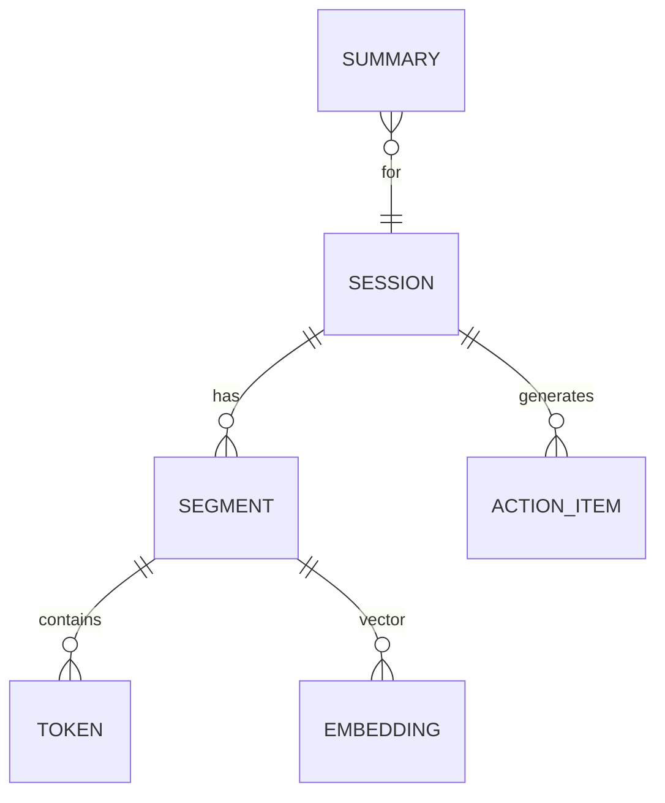

---
tags:
  - tech/ai/ml
  - type/concept
  - status/growing
description: hyprnote
created: 2025-01-01T00:00:00
updated: 2025-12-07T21:16:37
---

> [!info] **上级索引**
> [[AI MOC]] | [[学科知识 MOC]]

---


# hyprnote

## 基础概念

目标：将语音会议 / 访谈 / 灵感记录快速转成可搜索、可结构化、可摘要、可协作的知识条目。

核心流程（Pipeline）：
1. Capture 采集：麦克风 / 上传音频 / 屏幕系统声
2. Preprocess 预处理：采样率统一(16k)、降噪、VAD 切分、重叠拼接
3. ASR 识别：Whisper / faster-whisper / 云服务 fallback
4. Segmentation 语义切段：基于时间+句子终止符或 embedding 聚类
5. NLU 增强：说话人分离（Diarization），意图分类，关键词抽取
6. Summarization 摘要：抽取式+生成式（RAG + LLM）
7. Structuring 结构化：自动生成大纲、任务列表、行动项 (Action Items)
8. Storage 存储：向量索引（FAISS / Milvus） + 文档存档（Markdown/JSON）
9. Search 检索：语义检索 + 关键词高亮 + 过滤（时间 / 说话人 / 标签）
10. Share 协作：链接/权限/版本历史

价值：减少手动整理成本；提升复盘效率；降低遗忘与信息流失。

数据模型（简化）：


## 使用指南

### 本地快速原型（示意）
```python
audio_path = record_or_upload()
chunks = vad_split(audio_path)
texts = [asr(c) for c in chunks]
doc = stitch(texts)
summary = llm_summarize(doc)
actions = extract_actions(doc)
save(doc, summary, actions)
```

### 识别（Whisper + faster-whisper）
1. 根据设备选择 small/base/medium；长会议可分段并行
2. 若 GPU 忙：降级到 CPU int8 模式

### 说话人分离 (Diarization)
工具：pyannote.audio / whisper-diarization；流程：VAD -> speaker embedding -> 聚类 -> 对齐片段。

### 关键词 / Embedding
模型：Instructor / bge / text-embedding-3-large；存储：FAISS / SQLite + HNSW 插件。

### 摘要策略
1. Multi-Pass：先分段摘要再汇总（树形）
2. 角色视角：面向产品/技术/运营生成不同角度摘要
3. Action Items：正则 + LLM 抽取动词+责任人+时间

### 检索 UI 交互要点
- 输入语义查询 -> 向量召回 top-k
- 高亮匹配片段 + 允许播放对应音频
- 支持 过滤：日期 / 标签 / 说话人 / 会议类型

### 同步 & 协作
增量保存 diff；支持 CRDT/Yjs 实时协作；版本快照：定期 checkpoint。

### 安全与权限
RBAC：session 级 read/write；脱敏：命名实体识别 + 脱敏策略（掩码/替换）。

### 部署形态
- 桌面端：Tauri/Electron 集成本地麦克风权限
- Web：前端录音 MediaRecorder + 分片上传
- Server：FastAPI + 队列 (Celery/RQ) + GPU Worker
- Edge：短音频客户端直接 WebAssembly 模型（未来）

## 实战经验

1. 延迟优化：前 5 秒滚动识别（Streaming chunk）≥ 用户感知即时性
2. 批次聚合：多个短 chunk 合并提交模型减少启动开销
3. 缓存：同一音频 hash (SHA256) 结果复用
4. 错误纠正：用户编辑 -> 反馈回训练/自适应词典
5. 时序对齐：使用重叠 + 动态时间规整（DTW）修正边界
6. 多语言混杂：分段检测语言 -> 分别调用对应 token 设置
7. GPU 利用：任务队列按时长排序（Longest First/Shortest First 混合）
8. 成本控制：低价值会话（噪声、闲聊）可直接压缩/丢弃
9. 隐私：加密存储（AES-GCM）；日志脱敏；访问审计
10. 灾备：对象存储 + 周期性清理临时 PCM

问题场景：
- 背景音乐影响识别：需 BGM 抑制或带通滤波
- 责任人解析失败：需要 NER + 组织通讯录映射
- 摘要遗漏行动项：单独动作抽取管线优先于全局摘要
- 海量 session 检索慢：向量分片 + IVF/HNSW 加速

## 经验总结

关键抓手：高质量切分 -> 稳定低延迟 ASR -> 结构化提炼 -> 反馈闭环。用户价值集中在 准确 + 快 + 结构化 输出。后期差异化：个性化摘要、知识图谱联接、跨会议趋势分析。

## 信息参考

- Whisper: 参见 `OpenAI Whisper` 文档
- pyannote: <https://github.com/pyannote/pyannote-audio>
- FAISS: <https://github.com/facebookresearch/faiss>
- Milvus: <https://milvus.io>
- Yjs: <https://yjs.dev>
