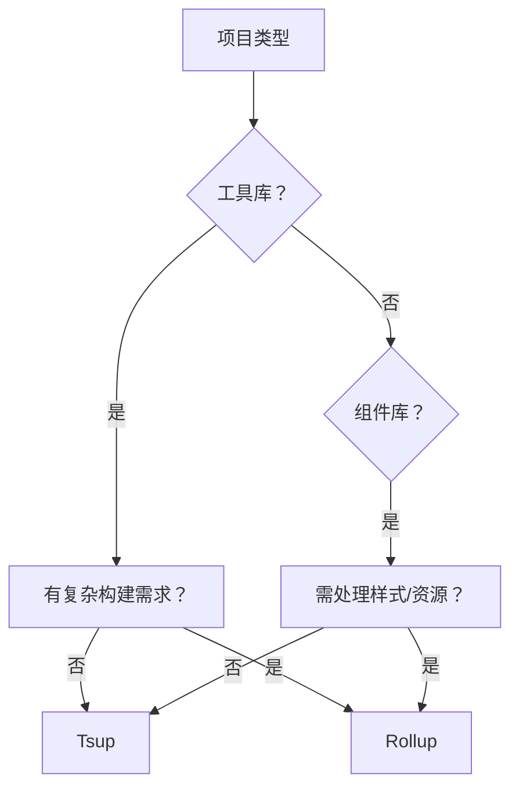

---
tags:
  - tech/lang/javascript
  - type/concept
  - status/growing
description: Rollup与Tsup打包工具对比分析
created: 2025-01-01T00:00:00
updated: 2025-12-07T21:16:37
---

> [!info] **上级索引**
> [[ECMAScript MOC]] | [[前端基础 MOC]]

---

# rollup与tsup对比 

以下是 Rollup 和 Tsup 的对比分析，结合工具库/组件库场景的选型建议：

---

### 🧩 核心差异概览

| **特性**| **Rollup**| **Tsup**|
|----------------|-------------------------------|--------------------------------|
| **定位**| 通用库打包工具| 专为 TypeScript 库优化的零配置工具 |
| **构建引擎**| 自研（支持插件扩展）| 基于 ESBuild（极速）|
| **配置复杂度** | 高（需手动配置插件）| **低（开箱即用）**|
| **TypeScript** | 需插件（如 `@rollup/plugin-typescript`） | **原生零配置支持**|
| **多格式输出** | **支持更灵活**（ESM/CJS/UMD 等） | 需显式配置（如 `format: ["esm", "cjs"]`） |
| **构建速度**| 较慢| **极快（ESBuild 优势）**|

---

### 🛠️ 工具库场景建议

1. **Rollup 更适合：**
- 需输出复杂格式（如 UMD + ESModule 混合包）。
- 需深度定制构建流程（例如特殊资源处理、代码分片）。
- 项目依赖大量 Rollup 专属插件（如可视化分析、复杂 Tree-Shaking）。

2. **Tsup 更适合：**
- 纯 TypeScript 代码库，追求零配置快速启动。
- 无需特殊资源处理，仅需生成 ESM/CJS 格式。
- **工具库推荐场景**：轻量级工具函数库、无副作用的纯逻辑包。

> ✅ **结论：工具库优先选 Tsup**，除非有复杂定制需求。

---

### 🧩 组件库场景建议

1. **Rollup 更适合：**
- 需处理 CSS/静态资源（需配合 `rollup-plugin-postcss` 等插件）。
- 需生成独立按需加载的组件（通过 `@rollup/plugin-multi-entry` 分块）。
- 需兼容旧版浏览器（通过 Babel 插件精细控制降级）。

2. **Tsup 更适合：**
- 组件库为纯 TS/JS 实现（无样式或样式外置）。
- 组件以单一入口导出（无需复杂分块）。
- **组件库推荐场景**：Headless UI 库、无样式的逻辑组件库。

> ✅ **结论：组件库优先选 Rollup**（资源处理更成熟），若项目极简可考虑 Tsup。

---

### 📊 决策流程图

---

### 💡 最终建议

- **工具库选 Tsup**：享受零配置 + 极速构建，适合大多数场景。
- **组件库选 Rollup**：灵活处理资源，生态插件覆盖更广。
- **混合型项目**：用 Rollup 作为基础，通过插件组合实现需求。

如果你有具体的项目需求（例如是否需要兼容 IE11、是否包含 CSS-in-JS 等），我可以进一步提供针对性优化方案。是否需要我帮你细化某个场景的配置示例？
