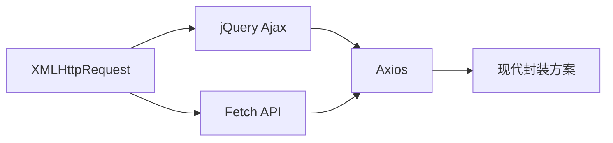

---
tags:
  - tech/lang/javascript
  - type/concept
  - status/growing
description: 前端 HTTP 请求技术 - Ajax/Fetch/Axios 全面指南
created: 2025-12-08T00:00:00
updated: 2025-12-08T00:00:00
---

> [!info] **上级索引**
> [[ECMAScript MOC]] | [[前端基础 MOC]] | [[计算机网络 MOC]]

---

# 前端 HTTP 请求

> 前端与后端通信的核心技术，从原生 XMLHttpRequest 到现代 Fetch API 和 Axios 库。

---

## 📚 技术演进路线



| 技术 | 年代 | 特点 | 推荐度 |
|------|------|------|--------|
| XMLHttpRequest | 1999 | 原生、回调地狱 | ⭐ |
| jQuery.ajax | 2006 | 简化 XHR、依赖 jQuery | ⭐⭐ |
| Fetch API | 2015 | 原生 Promise、现代语法 | ⭐⭐⭐⭐ |
| Axios | 2014 | 功能丰富、拦截器、取消请求 | ⭐⭐⭐⭐⭐ |

---

## 🔧 技术详解

### 1. XMLHttpRequest (XHR)

最原始的 Ajax 技术，基于回调：

```javascript
const xhr = new XMLHttpRequest();
xhr.open('GET', '/api/data', true);
xhr.onreadystatechange = function() {
  if (xhr.readyState === 4 && xhr.status === 200) {
    console.log(JSON.parse(xhr.responseText));
  }
};
xhr.send();
```

**缺点**：
- 回调地狱
- 语法繁琐
- 不支持 Promise

---

### 2. Fetch API

现代浏览器原生支持的请求 API：

```javascript
// GET 请求
fetch('/api/data')
  .then(response => response.json())
  .then(data => console.log(data))
  .catch(error => console.error(error));

// async/await 语法
async function getData() {
  try {
    const response = await fetch('/api/data');
    const data = await response.json();
    return data;
  } catch (error) {
    console.error(error);
  }
}

// POST 请求
fetch('/api/data', {
  method: 'POST',
  headers: {
    'Content-Type': 'application/json',
  },
  body: JSON.stringify({ name: 'John' }),
});
```

**优点**：
- 原生支持，无需引入库
- 基于 Promise
- 语法简洁

**缺点**：
- 不会自动拒绝 HTTP 错误状态码（如 404、500）
- 不支持请求取消（需配合 AbortController）
- 不支持请求进度监控
- 不自动转换 JSON

详见：[[Fetch API]]

---

### 3. Axios

功能最丰富的 HTTP 客户端库：

```javascript
import axios from 'axios';

// GET 请求
const response = await axios.get('/api/data');
console.log(response.data);

// POST 请求
await axios.post('/api/data', { name: 'John' });

// 创建实例
const api = axios.create({
  baseURL: 'https://api.example.com',
  timeout: 5000,
  headers: { 'Authorization': 'Bearer token' }
});

// 拦截器
api.interceptors.request.use(config => {
  // 请求发送前处理
  return config;
});

api.interceptors.response.use(
  response => response,
  error => {
    // 统一错误处理
    return Promise.reject(error);
  }
);
```

**优点**：
- 自动转换 JSON
- 拦截器（请求/响应）
- 取消请求
- 超时设置
- 进度监控
- 浏览器和 Node.js 通用

详见：[[axios]]

---

## 🔗 相关笔记

### 请求库
- [[axios]] - Axios HTTP 客户端详解
- [[Fetch API]] - 原生 Fetch API
- [[XMLHttpRequest]] - 原始 Ajax 技术

### 实时通信
- [[WebSocket]] - 双向实时通信
- [[Server-Sent-Events]] - 服务端推送
- [[长轮询 (Long-Polling)]] - 长轮询技术

### HTTP 相关
- [[HTTP缓存]] - HTTP 缓存机制
- [[前端HTTP状态码的处理]] - 状态码处理
- [[前端接收流式数据的方案]] - 流式数据接收

---

## 📊 选型建议

| 场景 | 推荐技术 |
|------|----------|
| 简单请求、轻量项目 | Fetch API |
| 复杂项目、需要拦截器 | Axios |
| 需要取消请求 | Axios 或 Fetch + AbortController |
| Node.js 环境 | Axios 或 node-fetch |
| 实时双向通信 | WebSocket |
| 服务端推送 | SSE |

---

> [!tip] 使用 Dataview 查看所有 HTTP 请求相关笔记
> ```dataview
> LIST
> FROM [[前端 HTTP 请求]]
> SORT file.name ASC
> ```
